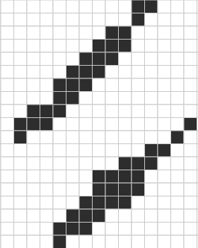
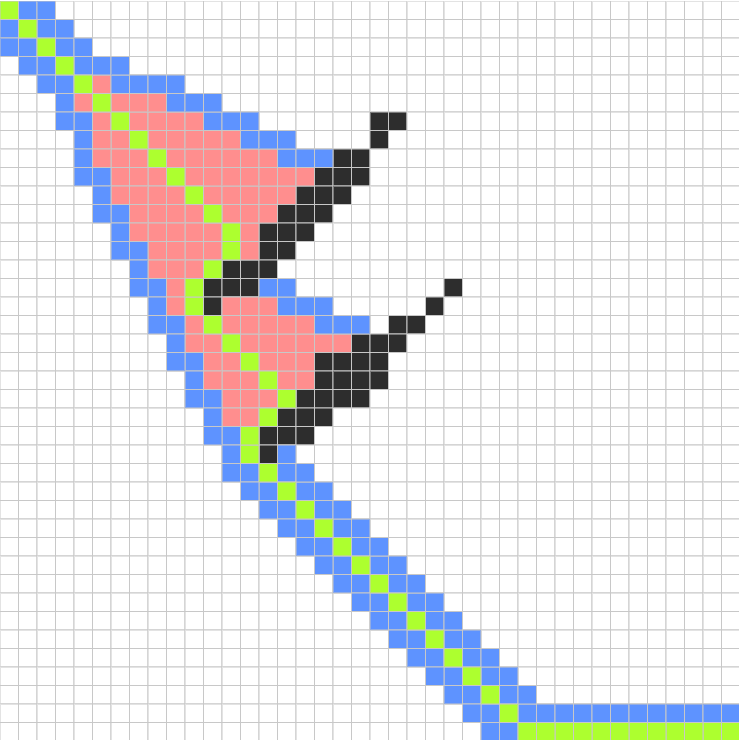

# A* Path Finding

## Problem

Develop a path finding algorithm based on the [A* search algorithm](https://en.wikipedia.org/wiki/A*_search_algorithm).

## Environment

A grid with size `40 x 40` of `Spot`s or nodes.

Each `Spot` can be in either traversable or not.

>   At initialization:
>
>   *   `black` `Spots` are walls.
>   *   `white` `Spots` are traversable.
>
>   

One `Spot` is marked as the `start` and another is marked as the `end`.

The goal of the algorithm is to find and draw a path of `Spots` from the `start` to the `end`.

## Method

For a particular `Spot`, A* search uses 2 costs:

*   `G` - distance from `start`
*   `H` - distance from `end` (heuristic)

It computes `F = G + H`

The following Python code illustrates the A* search algorithm:

```python
def a_start(spots, start, end):
    open_spots = set()      # to be evaluated
    closed_spots = set()    # already evaluated

    open_spots.add(start)

    while True:
        current = min(open_spots, key=lambda x: x.get_cost())           # get node with the least F cost
        open_spots.pop(current)                                         # remove it from open_spots
        closed_spots.add(current)                                       # add it to closed_spots

        if current == end:                                              # path is found
            return

        for neighbor in current.get_neighbors():
            if neighbor.wall() or neighbor in closed_spots:
                continue

            new_cost = neighbor.compute_cost()
            if new_cost < neighbor.get_cost() or neighbor not in open_spots:
                neighbor.set_code(new_cost)
                neighbor.set_parent(current)
                open_spots.add(neighbor)
```

>   At runtime:
>
>   *   `blue` `Spots` indicate `Spots` in the `open` set
>   *   `red` `Spots` indicate `Spots` in the `closed` set
>   *   `green` `Spots` indicate the path to the `current` `Spot`
>
>   

## Implementation

This simulation was implemented in [JavaScript](https://www.javascript.com/) with the [Processing](https://p5js.org) graphics library.

## Team


|Name|ID|
|---|:---:|
|_Kelvin DeCosta_|**2016A7TS0006U**|
|_Shaun Fernandes_|**2016A7PS0290U**|
